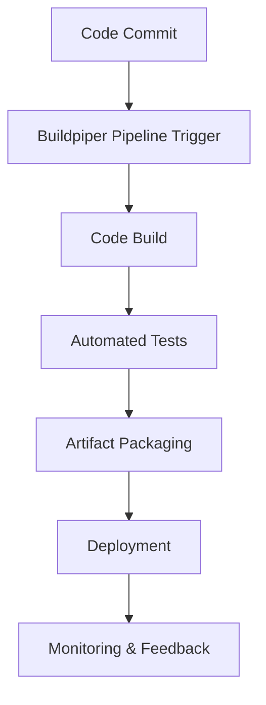

# BuildPiper Documentation

## Introduction
This documentation provides a simple and practical guide about BuildPiper's CI orchestration tools, which automate building, testing, and deploying code while streamlining microservices delivery.

## What is BuildPiper?
BuildPiper is an engineering productivity platform crafted by OpsTree Labs supporting end-to-end application delivery from code commit to production, microservices onboarding, and fully automated CI/CD pipelines. Its orchestration engine manages the flow of code from source control to production—coordinating build, test, packaging, and deployment—while offering easy setup, configuration, and monitoring of scalable, efficient pipelines for modern teams.

## Why Use BuildPiper?
Traditional CI/CD tools often require extensive scripting, fragmented security practices, and manual scaling. BuildPiper provides a standardized, DevSecOps-ready, Kubernetes-native solution, reducing operational overhead and technical debt while enabling:
- Faster Time-to-Market: Up to 70% reduction in deployment cycles.

- Greater Productivity: Automated workflows save 10+ developer hours/week.

- Lower Infrastructure Cost: Real-time observability drives 30% savings.

- Process Compliance: Embedded gates and customizable checks ensure 98%+ compliance.

- High Scalability and Reliability: Auto-scaling agents handle variable loads.

## Workflow Diagram

## Advantages

| Advantage                | Description                                                      |
|--------------------------|------------------------------------------------------------------|
| Automation               | Reduces manual work and automates repetitive steps.              |
| Speed                    | Accelerates build, test, and deployment processes.               |
| Consistency              | Ensures standardized workflows and reliable results.             |
| Collaboration            | Enables teamwork and quick feedback cycles.                      |
| Scalability              | Handles large-scale projects and growing teams with ease.        |

## Best Practices

| Best Practice            | Description                                                      |
|--------------------------|------------------------------------------------------------------|
| Modular Pipelines        | Design workflows as reusable modules for flexibility.            |
| Automated Testing        | Integrate tests at every stage to catch issues early.            |
| Version Control          | Track changes and maintain history with source control systems.  |
| Monitoring & Alerts      | Set up real-time monitoring and notifications for failures.      |
| Documentation            | Keep pipeline steps and configurations well documented.          |

## Conclusion
 Buildpiper simplify and automate the software delivery process. They improve efficiency, reliability, and collaboration, making it easier for teams to release high-quality software quickly. Adopting these tools supports continuous improvement and adaptability in dynamic development environments.

## Contact Information
- Email: support@buildpiper.io
- Website: https://www.buildpiper.io
- LinkedIn: [Buildpiper](https://www.linkedin.com/company/buildpiper/)

## References

| Reference                        | Link                                                     |
|-----------------------------------|----------------------------------------------------------|
| Buildpiper Documentation          | [Docs](https://docs.buildpiper.io)                       |
| Workflow Automation               | [Buildpiper Blog](https://www.buildpiper.io/blog/)       |
