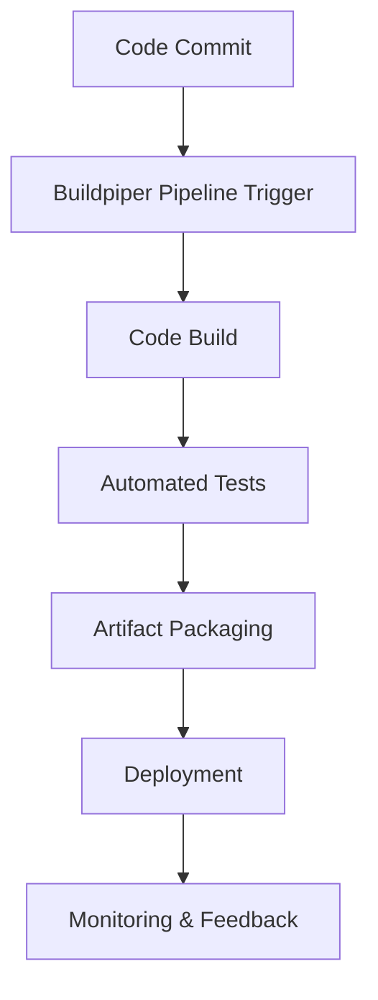

# BuildPiper Documentation

---
## Author Information
| Last Updated On | Version | Author       | Level           | Reviewer   |
|-----------------|---------|--------------|-----------------|------------|
| 24-07-2025      | V1.0    | Sachin Kumar | Internal Review | Pritam     |
| 25-07-2025      | V1.1    | Sachin Kumar | L0              |Shreya/Sharvari|
|                 |         | Sachin Kumar | L1              | Abhishek V |
|                 |         | Sachin Kumar | L2              | Abhishek Dubey/Rishabh sharma|
---

## Table of Contents
- [Introduction](#introduction)
- [What is BuildPiper?](#what-is-buildpiper)
- [Why Use BuildPiper?](#why-use-buildpiper)
- [Workflow Diagram](#workflow-diagram)
- [Advantages](#advantages)
- [Best Practices](#best-practices)
- [Conclusion](#conclusion)
- [Contact Information](#contact-information)
- [References](#references)
---

## Introduction
This documentation provides a simple and practical guide about BuildPiper's CI orchestration tools, which automate building, testing, and deploying code while streamlining microservices delivery.

---

## What is BuildPiper?
BuildPiper is an engineering productivity platform crafted by OpsTree Labs supporting end-to-end application delivery from code commit to production, microservices onboarding, and fully automated CI/CD pipelines. Its orchestration engine manages the flow of code from source control to production—coordinating build, test, packaging, and deployment—while offering easy setup, configuration, and monitoring of scalable, efficient pipelines for modern teams.

---

## Why Use BuildPiper?
Traditional CI/CD tools often require extensive scripting, fragmented security practices, and manual scaling. BuildPiper provides a standardized, DevSecOps-ready, Kubernetes-native solution, reducing operational overhead and technical debt while enabling:
- Faster Time-to-Market: Up to 70% reduction in deployment cycles.

- Greater Productivity: Automated workflows save 10+ developer hours/week.

- Lower Infrastructure Cost: Real-time observability drives 30% savings.

- Process Compliance: Embedded gates and customizable checks ensure 98%+ compliance.

- High Scalability and Reliability: Auto-scaling agents handle variable loads.

---

## Workflow Diagram

---

## Advantages

| Advantage                     | Description                                                                                  |
|-------------------------------|----------------------------------------------------------------------------------------------|
| No Scripting Required         | Visual job and pipeline editor for intuitive workflows.                                      |
| Security First                | CI gate checks, image scanning, secrets management via Hashicorp Vault.                      |
| Comprehensive Integrations    | External tool and API support for collaboration (JIRA, Teams).                               |
| Customizable Pipelines        | Conditional job execution and YAML/GUI interfaces.                                           |
| Dynamic Environments          | Rapid environment spin-up, easy rollback, and A/B testing.                                   |
| Enhanced Developer Experience | One platform for all CI/CD, Kubernetes, and microservices needs.                             |

---

## Best Practices

| Best Practice                | Description                                                                                          |
|------------------------------|------------------------------------------------------------------------------------------------------|
| Adopt GitOps Workflows       | Automate deployments using declarative manifests and infrastructure-as-code.                         |
| Embed Security Checks        | Integrate automated CI gate checks at every pipeline stage (code quality, coverage, security scan).  |
| Standardize Job Templates    | Use reusable, compliant job templates for consistent delivery.                                       |
| Enable Observability Early   | Set up monitoring and logging tools (Prometheus, Grafana) from Day 1.                                |
| Continuous Feedback          | Monitor performance, validate deployments, and optimize based on real-time analytics.                |

---

## Conclusion
Buildpiper simplify and automate the software delivery process. They improve efficiency, reliability, and collaboration, making it easier for teams to release high-quality software quickly. Adopting these tools supports continuous improvement and adaptability in dynamic development environments.

---
## Contact Information
| Name            | Email Address                         |
|-----------------|---------------------------------------|
| Sachin Kumar  | [sachin.kumar.snaatak@mygurukulam.co](sachin.kumar.snaatak@mygurukulam.co) |
---

## References

| Reference                        | Link                                                     |
|-----------------------------------|----------------------------------------------------------|
| Buildpiper Documentation          | [Docs](https://docs.buildpiper.io)                       |
| Workflow Automation               | [Buildpiper Blog](https://www.buildpiper.io/blog/)       |
