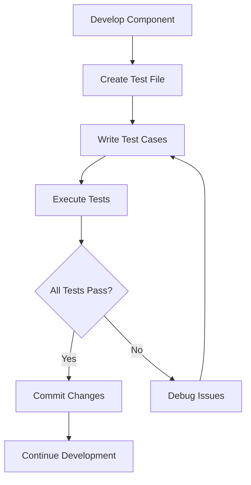

# Documentation on React Unit Testing

---
## Author Information
| Last Updated On | Version | Author       | Level           | Reviewer   |
|-----------------|---------|--------------|-----------------|------------|
| 20-08-2025      | V1.0    | Sachin Kumar | Internal Review | Pritam     |
| 21-08-2025      | V1.1    | Sachin Kumar | L0              |Shreya/Sharvari|
|                 |         | Sachin Kumar | L1              | Abhishek V |
|                 |         | Sachin Kumar | L2              | Abhishek Dubey/Rishabh sharma|
---

## Table of Contents
- [Introduction](#introduction)
- [What is React Unit Testing?](#what-is-react-unit-testing)
- [Why React Testing?](#why-react-testing)
- [Workflow Diagram](#workflow-diagram)
- [Tools Comparison](#tools-comparison)
- [Key Advantages of Unit Testing](#key-advantages-of-unit-testing)
- [Proof of Concept (POC)](#proof-of-concept-poc)
- [Best Practices](#best-practices)
- [Conclusion](#conclusion)
- [Contact](#contact)
- [References](#references)

## Introduction
This documentation provides a comprehensive guide to implementing unit testing for React applications using Jest as the primary testing framework. It covers the fundamentals, benefits, and recommended practices for establishing an effective testing workflow.

## What is React Unit Testing?
React unit testing is the practice of verifying individual React components and their associated logic in isolation to ensure they function as intended. This process includes:

- Validating component rendering under various conditions
- Testing user interactions and event handling
- Verifying prop validation and state management
- Ensuring utility functions produce expected outputs

## Why React Testing?
Implementing testing in React applications offers numerous advantages:

- **Early defect detection** - Identify issues during development phase
- **Behavior documentation** - Tests serve as executable specifications
- **Refactoring confidence** - Safely modify code with test coverage
- **Improved design** - Encourages modular, testable component architecture
- **Regression prevention** - Catch breaking changes immediately
- **Team alignment** - Shared understanding of component contracts

## Workflow Diagram

## React Unit Testing Tools Comparison

| Feature/Capability       | Jest          | React Testing Library | Vitest       | Cypress Component |
|-------------------------|---------------|-----------------------|--------------|-------------------|
| **Testing Scope**        | Comprehensive | DOM Focused           | Vite Optimized | Browser-based     |
| **Execution Speed**      | Fast          | Fast                  | Very Fast     | Slow              |
| **React Integration**    | Excellent     | Excellent             | Excellent     | Good              |
| **Assertion Library**    | Included      | Required Addition     | Included      | Included          |
| **Snapshot Testing**     | Supported     | Not Applicable        | Supported     | Not Supported     |
| **Code Coverage**        | Built-in      | Requires Runner       | Built-in      | Limited           |
| **Debug Experience**     | Good          | Excellent             | Good          | Excellent         |

---

## Key Advantages of Unit Testing

| Category               | Benefit/Point                       | Description/Impact                                                        |
|------------------------|-------------------------------------|---------------------------------------------------------------------------|
| **Development Efficiency** | Immediate feedback on code changes  | Developers see results of changes instantly, speeding up the workflow.    |
| **Quality Assurance**      | Consistent component behavior       | Ensures components work as expected across releases and changes.          |
| **Maintenance Benefits**   | Clear component contracts           | Tests specify component responsibilities and expected behavior.            |
| **Process Improvements**   | Enables continuous integration      | Automated testing allows for frequent and reliable code integration.       |

---

## Proof of Concept (POC)

*[Visit here]() for a step-by-step guide on how to perform a Unit testing in React.*

---

## Best Practices

| Category        | Description                                                                |
|-----------------|-------------------------------------------------------------------------------------------|
| **Test Structure**  | Use consistent naming conventions, organize tests by component features, and group related cases logically for clarity and maintainability. |
| **Test Design**     | Focus on component behavior, test user-facing functionality, cover both positive/negative scenarios, and verify edge conditions for comprehensive coverage. |
| **Maintenance**     | Review test coverage regularly, update tests with component changes, remove obsolete cases, and monitor test execution time to keep tests relevant and efficient. |

---

## Conclusion
After careful evaluation of all available testing frameworks, we have determined that **Jest** will be our exclusive choice for unit testing React applications.

---
## Contact Information
| Name            | Email Address                         |
|-----------------|---------------------------------------|
| Sachin Kumar  | [sachin.kumar.snaatak@mygurukulam.co](sachin.kumar.snaatak@mygurukulam.co) |
---

## References  

| Title                          | Link                                                                 |  
|--------------------------------|----------------------------------------------------------------------|  
| **Jest Documentation**       | [Visit](https://jestjs.io/) |  
| **React Testing Best Practices**                  | [Visit](https://legacy.reactjs.org/docs/testing.html) |  
