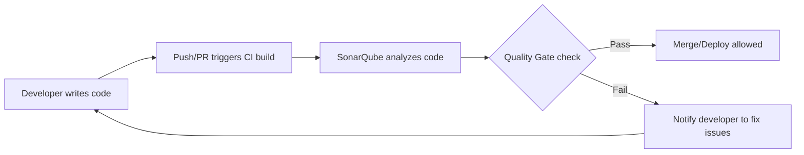

# SonarQube Quality Gates Documentation

---

## Table of Contents

1. [Introduction](#introduction)
2. [What are SonarQube Quality Gates?](#what-are-sonarqube-quality-gates)
3. [Why Use Quality Gates?](#why-use-quality-gates)
4. [Workflow Diagram](#workflow-diagram)
5. [Identification of Quality Gates](#identification-of-quality-gates)
    - [Default Quality Gates](#default-quality-gates)
    - [Custom Quality Gates](#custom-quality-gates)
6. [Advantages of Quality Gates](#advantages-of-quality-gates)
7. [Best Practices](#best-practices)
8. [Conclusion](#conclusion)
9. [Contact Information](#contact-information)
10. [References](#references)

---

## Introduction

This documentation provides a simple and practical guide about SonarQube Quality Gates: what they are, why you need them, how they work, and how to use them effectively.

---

## What are SonarQube Quality Gates?

Quality Gates are simple rules in SonarQube that check your code for problems like bugs, security issues, and bad practices before the code moves forward.

---

## Why Use Quality Gates?

Quality Gates help you catch issues early, make code safer, and keep your project healthy by stopping bad code from being released.

---

## Workflow Diagram

---

## Identification of Quality Gates

Quality Gates are like traffic lights for your code. They tell you if your code is good to go or if it needs fixing.

### **Default Quality Gate:**  
  SonarQube comes with a ready-to-use Quality Gate called "Sonar way." It checks for basic things like no new serious bugs, high enough test coverage, and not too much duplicated code.
which typically checks for:
- No new critical or blocker issues (bugs, vulnerabilities)
- No new code coverage < 80%
- No new code duplications > 3%
- No new code smells above a threshold

### **Custom Quality Gates:**  
  You can make your own Quality Gates if the default one doesn’t fit your needs. For example:
- Add or remove conditions (e.g., increase code coverage requirement, add security hotspot checks)
- Set conditions based on different severities or metrics
- Assign different gates to different projects or branches (e.g., stricter rules for main branch, relaxed for feature branches)

**How to find Quality Gates in SonarQube:**
1. Log in to SonarQube.
2. Click on "Quality Gates" in the main menu.
3. Here, you can see the list of all gates, what they check, and which projects use them.

---

## Advantages of Quality Gates

| Advantage                 | Description                                                         |
|---------------------------|---------------------------------------------------------------------|
| Early Issue Detection     | Find bugs and issues before they reach production.                   |
| Consistent Code Quality   | Enforce the same rules for every project.                            |
| Automated Checks          | No need for manual review for common problems.                       |
| Safer Releases            | Reduce the risk of releasing buggy or insecure code.                 |
| Easy Feedback             | Developers know quickly if their code is good or needs changes.      |

---

## Best Practices

| Best Practice                 | Description                                                    |
|-------------------------------|----------------------------------------------------------------|
| Start Simple                  | Use the default gate first, then adjust as needed.             |
| Focus on New Code             | Apply gates to new code to avoid legacy issues.                |
| Review Regularly              | Check and update gates to match team goals.                    |
| Integrate with CI/CD          | Block merges/deploys if the gate fails.                        |
| Educate Your Team             | Make sure everyone understands the Quality Gate rules.          |

---

## Conclusion

Quality Gates in SonarQube make sure only good code goes forward. They’re easy to use, help your team, and keep your projects healthy.

---

## Contact Information

For questions or support, contact:

- **Quality Engineering Team**
- Email: quality@yourcompany.com
- Phone: +1-800-123-4567
- Slack: #sonarqube-support

---

## References

| Reference                           | Link                                                                                   |
|--------------------------------------|----------------------------------------------------------------------------------------|
| SonarQube Quality Gates Docs         | [https://docs.sonarqube.org/latest/user-guide/quality-gates/](https://docs.sonarqube.org/latest/user-guide/quality-gates/) |
| SonarQube Official Website           | [https://www.sonarqube.org/](https://www.sonarqube.org/)                               |
| SonarQube Community                  | [https://community.sonarsource.com/](https://community.sonarsource.com/)               |
| CI/CD Integration with SonarQube     | [https://docs.sonarqube.org/latest/analysis/scan/sonarscanner/](https://docs.sonarqube.org/latest/analysis/scan/sonarscanner/) |
