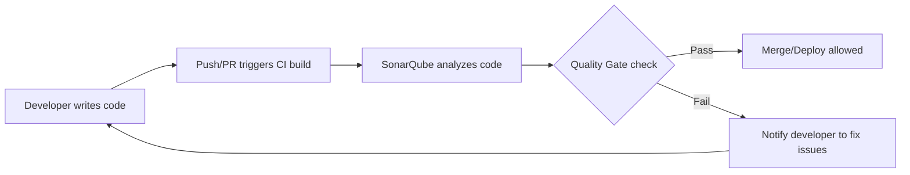

# SonarQube Quality Gates Documentation

---
## Author Information
| Last Updated On | Version | Author       | Level           | Reviewer   |
|-----------------|---------|--------------|-----------------|------------|
| 24-07-2025      | V1.0    | Sachin Kumar | Internal Review | Pritam     |
| 25-07-2025      | V1.1    | Sachin Kumar | L0              |Shreya/Sharvari|
|                 |         | Sachin Kumar | L1              | Abhishek V |
|                 |         | Sachin Kumar | L2              | Abhishek Dubey/Rishabh sharma|
---

---

## Table of Contents

1. [Introduction](#introduction)
2. [What are SonarQube Quality Gates?](#what-are-sonarqube-quality-gates)
3. [Why Use Quality Gates?](#why-use-quality-gates)
4. [Workflow Diagram](#workflow-diagram)
5. [Identification of Quality Gates](#identification-of-quality-gates)
    - [Default Quality Gates](#default-quality-gates)
    - [Custom Quality Gates](#custom-quality-gates)
6. [Advantages of Quality Gates](#advantages-of-quality-gates)
7. [Best Practices](#best-practices)
8. [Conclusion](#conclusion)
9. [Contact Information](#contact-information)
10. [References](#references)

---

## Introduction

This documentation provides a simple and practical guide about SonarQube Quality Gates: what they are, why you need them, how they work, and how to use them effectively.

---

## What are SonarQube Quality Gates?

 Quality Gates in SonarQube are simple rule sets that check your code for bugs, security issues, and bad practices, ensuring it meets the required quality standards before moving forward in the development pipeline, so only safe, clean, and maintainable code progresses to the next stage.

---

## Why Use Quality Gates?

Quality Gates act as a safety net that catches issues early, making code safer and projects healthier by stopping bad code from being released. They ensure only code meeting team standards moves forward, helping avoid bugs, improve coding practices, reduce costs, and deliver reliable software faster.

---

## Workflow Diagram

---

## Identification of Quality Gates

Quality Gates are like traffic lights for your code. They tell you if your code is good to go or if it needs fixing.

### **Default Quality Gate:**  
  SonarQube comes with a ready-to-use Quality Gate called "Sonar way." It checks for basic things like no new serious bugs, high enough test coverage, and not too much duplicated code.
which typically checks for:
- No new critical or blocker issues (bugs, vulnerabilities)
- No new code coverage < 80%
- No new code duplications > 3%
- No new code smells above a threshold

### **Custom Quality Gates:**  
  You can make your own Quality Gates if the default one doesn’t fit your needs. For example:
- Add or remove conditions (e.g., increase code coverage requirement, add security hotspot checks)
- Set conditions based on different severities or metrics
- Assign different gates to different projects or branches (e.g., stricter rules for main branch, relaxed for feature branches)

**How to find Quality Gates in SonarQube:**
1. Log in to SonarQube.
2. Click on "Quality Gates" in the main menu.
3. Here, you can see the list of all gates, what they check, and which projects use them.

---

## Advantages of Quality Gates

| Advantage                 | Description                                                         |
|---------------------------|---------------------------------------------------------------------|
| Early Issue Detection     | Find bugs and issues before they reach production.                   |
| Consistent Code Quality   | Enforce the same rules for every project.                            |
| Automated Checks          | No need for manual review for common problems.                       |
| Safer Releases            | Reduce the risk of releasing buggy or insecure code.                 |
| Easy Feedback             | Developers know quickly if their code is good or needs changes.      |

---

## Best Practices

| Best Practice                 | Description                                                    |
|-------------------------------|----------------------------------------------------------------|
| Start Simple                  | Use the default gate first, then adjust as needed.             |
| Focus on New Code             | Apply gates to new code to avoid legacy issues.                |
| Review Regularly              | Check and update gates to match team goals.                    |
| Integrate with CI/CD          | Block merges/deploys if the gate fails.                        |
| Educate Your Team             | Make sure everyone understands the Quality Gate rules.          |

---

## Conclusion

Quality Gates in SonarQube are a powerful and easy way to keep your codebase healthy, reliable, and secure. By setting up and using these automated checks, your team can catch issues early, enforce coding standards, and confidently deliver better software.

---

## Contact Information

| Name            | Email Address                         |
|-----------------|---------------------------------------|
| Sachin Kumar  | [sachin.kumar.snaatak@mygurukulam.co](sachin.kumar.snaatak@mygurukulam.co) |

---

## References

| Reference                           | Link                                                                                   |
|--------------------------------------|----------------------------------------------------------------------------------------|
| SonarQube Quality Gates Docs         | [https://docs.sonarqube.org/latest/user-guide/quality-gates/](https://docs.sonarqube.org/latest/user-guide/quality-gates/) |
| SonarQube Official Website           | [https://www.sonarqube.org/](https://www.sonarqube.org/)                               |
| CI/CD Integration with SonarQube     | [https://docs.sonarqube.org/latest/analysis/scan/sonarscanner/](https://docs.sonarqube.org/latest/analysis/scan/sonarscanner/) |
