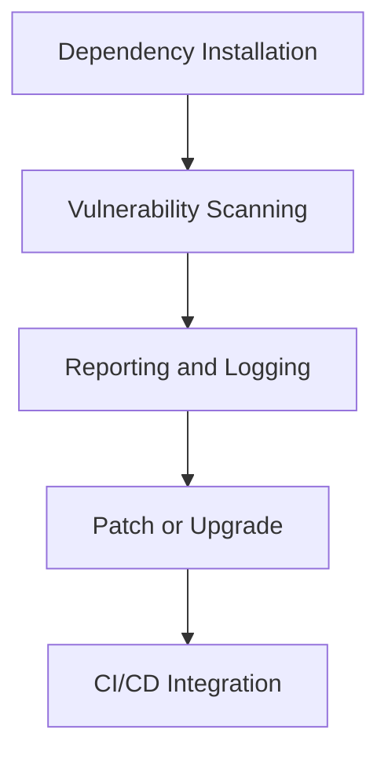

# Documentation on Dependency Checks 

---
## Author Information
| Last Updated On | Version | Author       | Level           | Reviewer   |
|-----------------|---------|--------------|-----------------|------------|
| 20-07-2025      | V1.0    | Sachin Kumar | Internal Review | Pritam     |
| 21-07-2025      | V1.1    | Sachin Kumar | L0              |Shreya/Sharvari|
|                 |         | Sachin Kumar | L1              | Abhishek V |
|                 |         | Sachin Kumar | L2              | Abhishek Dubey/Rishabh sharma|
---

## Table of Contents

---

## Introduction

This guide provides Python developers, security engineers, and DevOps professionals with the knowledge to implement dependency vulnerability checks. Given the growing reliance on third-party PyPI packages, identifying known vulnerabilities is a critical practice for securing the software supply chain.

---

## What are Python Dependency Vulnerability Checks?

Dependency vulnerability checks involve scanning installed or specified Python packages against public or curated databases of known security issues. These checks aim to:

- Detect outdated and vulnerable packages.
- Suggest safer versions or patches.
- Provide compliance and audit reports for secure SDLC.

---

## Why are Dependency Checks Important?

- **Supply Chain Security**: Prevent the use of malicious or compromised packages.
- **Vulnerability Management**: Identify known CVEs before they become attack vectors.
- **Compliance Readiness**: Satisfy security standards like ISO 27001, SOC 2, and OWASP.
- **Risk Mitigation**: Reduce risk of data breaches, DoS, or integrity loss from unpatched packages.
- **DevSecOps Alignment**: Embed security in the early stages of development.

---

## Workflow Diagram

### 1. Dependency Installation

Install project dependencies using `pip install` or from files like `requirements.txt`, `Pipfile`, or `pyproject.toml`.

### 2. Vulnerability Scanning

Run tools like `pip-audit` or `safety` to scan for CVEs or vulnerabilities from known databases.

### 3. Reporting and Logging

Generate and store reports in JSON or text format. These reports are used for tracking and compliance.

### 4. Patch or Upgrade

Update packages to patched versions or remove insecure dependencies where feasible.

### 5. CI/CD Integration

Incorporate scanning into GitHub Actions, Jenkins, or GitLab pipelines to enforce automated security gates.

---

## Tools for Python Dependency Checks

| Tool         | Maintainer      | Description |
|--------------|------------------|-------------|
| `pip-audit`  | PyPA             | Scans dependencies for known vulnerabilities using Python Advisory Database |
| `safety`     | PyUp             | Checks dependencies against a curated database of Python package vulnerabilities |
| `snyk`       | Snyk Ltd.        | Cloud-based scanner for multiple ecosystems with CLI support for Python |

---

## Comparison of Tools

| Feature                  | pip-audit          | safety            | snyk              |
|--------------------------|--------------------|--------------------|--------------------|
| **Python-focused**          | Yes                | Yes                | Yes                |
| **Free & Open Source**       | Yes                | Yes (basic only)   | No (Free Tier)     |
| **CVE Database**             | Python Advisory DB | PyUp DB            | Snyk DB            |
| **JSON Output**              | Yes                | Yes                | Yes                |
| **CI/CD Integration**        | Yes                | Yes                | Yes                |
| **Custom Policies**          | No                 | Yes (paid)         | Yes                |

---

## Advantages of Dependency Checks

- **Security Hardening**: Early detection prevents use of unsafe packages.
- **Auditable Artifacts**: JSON reports offer traceable documentation for audits.
- **Automated Risk Reduction**: Reduces manual work via CI/CD pipelines.
- **Reduced CVE Impact**: Proactive scanning limits exposure time to known threats.
- **Cross-Team Collaboration**: Shared scans foster awareness between Dev, Sec, and Ops teams.

---

## Proof of Concept (POC)

*[Visit here]() for a step-by-step guide on how to perform a Dependency Scan in python.*

---

## Best Practices

- Use **virtual environments** to isolate dependencies.
- Regularly update `requirements.txt` using `pip freeze > requirements.txt`.
- Integrate scans in **every PR or release pipeline**.
- Keep CI scans **fail-on-vulnerability** for critical CVEs.
- Use **multiple tools** in critical applications for wider coverage.
- Monitor **transitive dependencies** (e.g., packages used by your packages).
- Automate **patching of safe upgrades** with Renovate or Dependabot.

---

## Conclusion

Among the available tools, pip-audit is a straightforward, open-source tool built for Python. Other tools like Safety or Snyk provide more features, such as custom rules or wider security scans. However, pip-audit hits a sweet spot, being easy to use, accurate, and simple to add to automated pipelines for checking Python dependencies.

---
## Contact Information
| Name            | Email Address                         |
|-----------------|---------------------------------------|
| Sachin Kumar  | [sachin.kumar.snaatak@mygurukulam.co](sachin.kumar.snaatak@mygurukulam.co) |
---

## References

| Description                                    | Link                                                                                         |
|------------------------------------------------|----------------------------------------------------------------------------------------------|
| pip-audit official documentation               | [Visit](https://pypi.org/project/pip-audit/)                                                 |
| Python Packaging Security                      | [Visit](https://packaging.python.org/en/latest/guides/distributing-packages-using-setuptools/#security-best-practices) |
| OWASP Dependency-Check                         | [Visit](https://owasp.org/www-project-dependency-check/)                                     |
| SonarQube for Python                           | [Visit](https://docs.sonarsource.com/sonarqube/latest/analyzing-source-code/python/)         |
